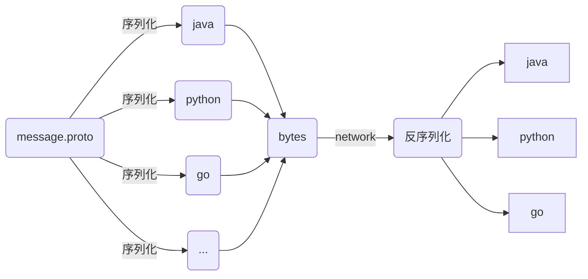

<!-- TOC -->

- [1. 主要内容](#1-%E4%B8%BB%E8%A6%81%E5%86%85%E5%AE%B9)
    - [1.1. protobuf 传输过程](#11-protobuf-%E4%BC%A0%E8%BE%93%E8%BF%87%E7%A8%8B)
    - [1.2. 使用 protoc](#12-%E4%BD%BF%E7%94%A8-protoc)
    - [1.3. protobuf API](#13-protobuf-api)
- [2. 参考](#2-%E5%8F%82%E8%80%83)

<!-- /TOC -->

# 1. 主要内容

什么是 protobuf？

protobuf 是一种数据格式。这种格式的数据可以跨语言传播。

如何使用 protobuf ？

使用 protobuf 需要三步：

1. 编写 protobuf 文件。该文件存储了数据信息
2. 使用 protobuf compiler （protoc）编译为对应语言的文件
3. 使用 protobuf API 编写程序


## 1.1. protobuf 传输过程


**protobuf 传输过程** 





## 1.2. 使用 protoc

下载地址：https://github.com/protocolbuffers/protobuf/releases，下载 `protoc-${version}-${platform}.zip` 的文件，解压得到一个 `protoc.exe` （我用的是 windows)，这个就是编译器了。

如何使用呢？

- 第一种方式。打开 cmd 窗口，直接敲命令，命令类似下面：

  ```
  protoc -I=$SRC_DIR --java_out=$DST_DIR $SRC_DIR/addressbook.proto
  ```

  **注意：这三个参数是必须的**

- 第二种方式，使用 maven 提供的插件，帮你执行上面的编译命令。插件配置和下面的内容差不多

  ```
   <build>
          <plugins>
              <plugin>
                  <groupId>org.apache.maven.plugins</groupId>
                  <artifactId>maven-antrun-plugin</artifactId>
                  <version>${maven-antrun-plugin.version}</version>
                  <dependencies>
                      <dependency>
                          <groupId>ant-contrib</groupId>
                          <artifactId>ant-contrib</artifactId>
                          <version>${ant-contrib.version}</version>
                          <exclusions>
                              <exclusion>
                                  <groupId>ant</groupId>
                                  <artifactId>ant</artifactId>
                              </exclusion>
                          </exclusions>
                      </dependency>
                  </dependencies>
                  <executions>
                      <execution>
                          <!-- 自定义id -->
                          <id>generate-protobuf-sources</id>
                          <!-- 指定绑定的Maven生命周期阶段 -->
                          <phase>generate-sources</phase>
                          <configuration>
                              <target>
                                  <!-- 自定义提示 -->
                                  <echo>Building Protobuf</echo>
                                  <!-- 删除proto编译后生成文件所在的目标目录 -->
                                  <delete dir="${basedir}/src/main/java"/>
                                  <!-- 新建proto编译后生成文件所在的目标目录 -->
                                  <mkdir dir="${basedir}/src/main/java"/>
                                  <!-- 指定proto定义文件所在目录 -->
                                  <path id="proto.path">
                                      <fileset dir="${basedir}/src/main/proto">
                                          <include name="**/*.proto"/>
                                      </fileset>
                                  </path>
                                  <pathconvert pathsep=" " property="proto.files" refid="proto.path"/>
                                  <!-- 需要执行的编译命令，和命令行编译proto文件其实一样 -->
                                  <exec executable="${basedir}/src/main/proto/protoc.exe" failonerror="true">

                                      <arg value="--java_out=${basedir}/src/main/java"/>
                                      <arg value="-I${basedir}/src/main/proto"/>
                                      <arg line="${proto.files}"/>
                                  </exec>
                              </target>
                              <!-- 指定生成源文件的source目录 -->
                              <sourceRoot>${basedir}/src/main/gen/gen-java</sourceRoot>
                          </configuration>
                          <goals>
                              <goal>run</goal>
                          </goals>
                      </execution>
                  </executions>
              </plugin>
          </plugins>
      </build>
  ```


**注意**

1. protoc 也是有版本的，`protoc --version` 可以查看版本。将 .proto 文件编译后，会得到对应语言的代码，这些代码可能需要依赖 protobuf 的一些包。比如，`java` 需要依赖 `proto-java` 的 jar 包，这个 jar 提供了一些类，是编译后的代码需要的。所以，`protoc` 的版本要和 `proto-java` 版本一致

2. protoc 编译命令的三个参数是必须的

   


## 1.3. protobuf API


protoc 编译后的 java 对象（这里，以 java 为例）有多个 API。感兴趣的可以看下


- **Builders API**

  编译后类提供了 builder，可以利用这个 API 创建一个对象

  ```java
  Person john =
    Person.newBuilder()
      .setId(1234)
      .setName("John Doe")
      .setEmail("jdoe@example.com")
      .addPhones(
        Person.PhoneNumber.newBuilder()
          .setNumber("555-4321")
          .setType(Person.PhoneType.HOME))
      .build();
  ```

  

- **Parsing and Serialization**

  下面是解析和序列化的 API

  - `byte[] toByteArray();`: serializes the message and returns a byte array containing its raw bytes.
  - `static Person parseFrom(byte[] data);`: parses a message from the given byte array.
  - `void writeTo(OutputStream output);`: serializes the message and writes it to an `OutputStream`.
  - `static Person parseFrom(InputStream input);`: reads and parses a message from an `InputStream`.


其它 API 可以参考官网


# 2. 参考


1. https://developers.google.com/protocol-buffers/docs/javatutorial
2. https://w3sun.com/1287.html

